<div align="center">

# Hi, I'm Junhyeok 👋

### Lua Developer · Network Engineer · Systems Enthusiast

**Building things closer to the network, runtime, and system.**

<br>


<br><br>


</div>

---

## 🚀 About Me

```lua
local junhyeok = {
    primary_language = "Lua",

    interests = {
        "Network Engineering",
        "Backend",
        "Systems Programming",
        "Reverse Proxy",
        "Runtime & Framework Design",
        "Open Source"
    },

    currently_learning = {
        "Rust",
        "C / C++",
        "TypeScript"
    },

    favorite_stack = {
        "Lua",
        "OpenResty",
        "HAProxy",
        "Rust",
        "PostgreSQL"
    }
}

return junhyeok
```

I love understanding **how things work underneath**.

Instead of only using frameworks and tools, I enjoy asking:

> How was this built?  
> Why was it designed this way?  
> Can I build something like this myself?

That curiosity led me from application development into **network infrastructure, systems programming, framework design, and open source.**

---

## 🌙 Lua

Lua is my primary language and the center of many of my projects.

I enjoy Lua not only as a scripting language, but also as an **embeddable language for building extensible systems**.

I work with:

<div align="center">


</div>

- Lua
- LuaJIT
- Luau
- Teal
- OpenResty
- Luvit
- Lapis

---

## ⚙️ Languages & Tools

### Languages

<p>
  
</p>

### Backend & Web

<p>
  
</p>

### Infrastructure

<p>
  
</p>

**Also working with**

`OpenResty` · `HAProxy` · `Envoy` · `Luvit` · `Lapis`

### Databases

<p>
  
</p>

---

# 🛰️ Featured Projects

## 🌙 Aether Framework

> A modular Lua-centric framework for building backend servers and proxies.

Aether explores a different approach to server architecture.

Instead of forcing developers into one fixed runtime or architecture, Aether aims to provide a core where functionality can be extended through modular components.

Modules can provide features such as:

- Routing
- ORM
- Authentication
- Cryptography
- Networking engines
- Proxy functionality

The goal is to let developers assemble their own backend or proxy environment around a lightweight Lua-oriented core.

**Tech**

`Lua` · `C/C++` · `Rust` · `libuv` · `cqueues`

---

## 🌐 L7 Proxy

A Layer 7 proxy project built around **OpenResty and Lua**, with native components where lower-level performance or functionality is useful.

```text
Client
   │
   ▼
TLS Proxy
   │
   ▼
HAProxy
   │
   ▼
OpenResty L7 Proxy
   │
   ├── Validation
   ├── Authentication
   ├── Rate Limiting
   └── Routing
         │
         ▼
      Services
```

**Tech**

`OpenResty` · `LuaJIT` · `Rust` · `HAProxy` · `Nginx`

---

# 🌍 Open Source

## 💙 Teal

I use **Teal**, a typed language that compiles to Lua.

While using Teal, I encountered a compatibility issue with a newer Lua version.

Instead of waiting for someone else to fix it, I investigated the problem, implemented a fix, and submitted a pull request.

That became one of my open-source contributions.

> **If the tool you use has a problem, you can help improve the tool itself.**

That's one of the things I enjoy most about open source.

---

# 🧠 What I'm Interested In

```text
Lua Runtime & Embedding
       │
       ├── LuaJIT
       ├── OpenResty
       └── Native FFI

Network Infrastructure
       │
       ├── Reverse Proxy
       ├── Load Balancing
       ├── TLS
       └── L7 Routing

Systems Programming
       │
       ├── Rust
       ├── C
       └── C++

Framework Design
       │
       ├── Aether
       ├── Plugin Architecture
       └── Modular Runtime
```

---

## 📊 GitHub Stats

<div align="center">




</div>

---

## 🔥 Contribution Streak

<div align="center">


</div>

---

## 🐍 Contributions

<div align="center">

<picture>
  <source
    media="(prefers-color-scheme: dark)"
    srcset="https://raw.githubusercontent.com/JJH090501/JJH090501/output/github-contribution-grid-snake-dark.svg"
  />
  <source
    media="(prefers-color-scheme: light)"
    srcset="https://raw.githubusercontent.com/JJH090501/JJH090501/output/github-contribution-grid-snake.svg"
  />
  
</picture>

</div>

---

<div align="center">

### 🌙 Lua · ⚙️ Systems · 🌐 Network

**Don't just use it. Understand how it works.**

</div>